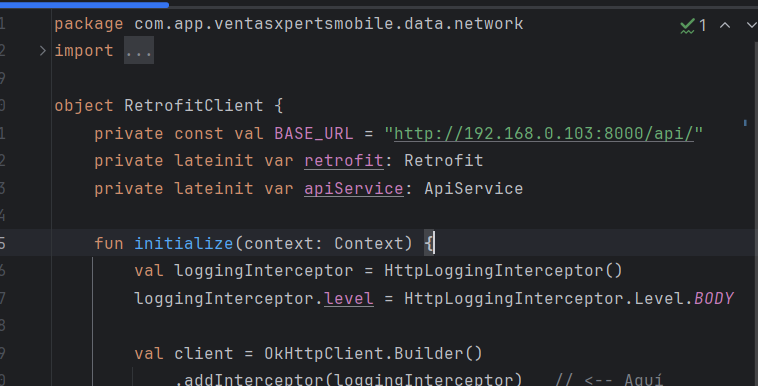

Cómo conectar la app Android con el backend Django desde un dispositivo en red local
Requisitos
Backend Django corriendo en tu PC/servidor con IP local fija (ejemplo: 192.168.0.103)

Dispositivo Android conectado a la misma red WiFi

Proyecto Android configurado para acceder al backend via IP local

Paso 1: Configurar y ejecutar Django para aceptar conexiones externas
Abre una terminal en tu proyecto Django y ejecuta:

bash
Copiar
python manage.py runserver 0.0.0.0:8000
Esto hará que el servidor escuche todas las interfaces de red en el puerto 8000.

Importante: Asegúrate que tu firewall o antivirus permita conexiones entrantes en ese puerto.

Paso 2: Usar la IP local en la app Android
En tu app Android, en el archivo donde defines la URL base (por ejemplo RetrofitClient), cambia:

kotlin
Copiar
private const val BASE_URL = "http://10.0.2.2:8000/api/"
por la IP local de tu PC:

kotlin
Copiar
private const val BASE_URL = "http://192.168.0.103:8000/api/"
Paso 3: Permitir tráfico HTTP (no seguro) en Android
Android 9+ bloquea por defecto las conexiones HTTP no seguras. Para permitirlo:

Crea el archivo res/xml/network_security_config.xml con este contenido:

xml
Copiar
<?xml version="1.0" encoding="utf-8"?>
<network-security-config>
    <domain-config cleartextTrafficPermitted="true">
        <domain includeSubdomains="true">192.168.0.103</domain>
    </domain-config>
</network-security-config>
En tu AndroidManifest.xml, dentro de la etiqueta <application>, añade:

xml
Copiar
android:networkSecurityConfig="@xml/network_security_config"
Ejemplo:

xml
Copiar
<application
    ...
    android:networkSecurityConfig="@xml/network_security_config"
    ...>
Paso 4: Conecta el dispositivo Android a la misma red WiFi
Asegúrate de que el dispositivo Android esté conectado al mismo WiFi que la PC donde corre Django.

Paso 5: Ejecuta y prueba la app
Inicia tu backend Django

Ejecuta la app en el dispositivo

La app debe poder comunicarse con el backend usando la IP local sin errores de conexión ni seguridad

Paso 6 (Opcional): Verifica la conexión
Puedes probar la conexión desde el navegador del dispositivo Android con la URL:

arduino
Copiar
http://192.168.0.103:8000/api/
Deberías ver la respuesta JSON de la API.

